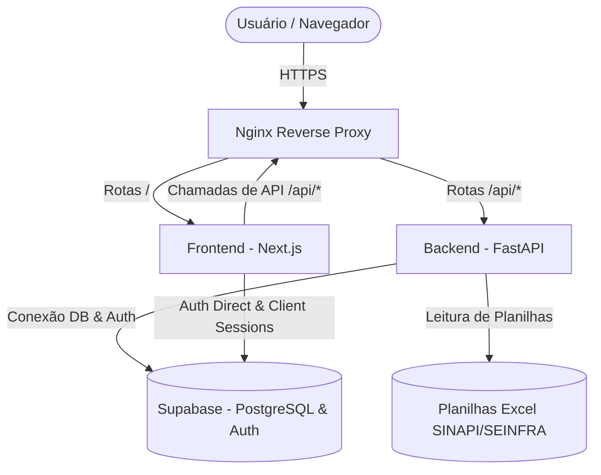

# 🏗️ Projeto Orçamento - Documentação do Sistema

O **Projeto Orçamento** é uma plataforma web completa para a **gestão e elaboração de orçamentos de construção civil**, permitindo o controle de obras de ponta a ponta. O sistema integra tabelas de referências oficiais de custos (SINAPI/SEINFRA), controle físico-financeiro, diários de obra, gerenciamento de equipes e relatórios para otimizar e acompanhar a execução dos empreendimentos.

---

## 🎯 Objetivo do Projeto

Facilitar e dar precisão ao processo de orçamentação e controle de obras na construção civil, permitindo a elaboração rápida de planilhas orçamentárias detalhadas com base em índices reais, importação simplificada de arquivos de insumos e composições, acompanhamento de custos e gestão de equipes em uma interface moderna e intuitiva.

---

## 💻 Arquitetura Técnica

O projeto é estruturado como um **monorepo**, contendo a separação física e lógica entre os componentes de frontend, backend, infraestrutura e arquivos de suporte.



### 1. Frontend (`/frontend`)
*   **Framework:** Next.js 14+ (App Router)
*   **Linguagem:** TypeScript
*   **Estilização:** Tailwind CSS & Shadcn/UI (Radix UI)
*   **Lógica de Comunicação:** Camada de serviço de API encapsulada (`src/lib/api/`) e Supabase JS SDK.
*   **Páginas Principais:**
    *   `login`/`signup`: Fluxo de acesso gerenciado pelo Supabase Auth.
    *   `obras`: Painel de controle de obras e orçamentos ativos, incluindo a planilha interativa e exportação de PDF.
    *   `bases`: Interface de pesquisa de tabelas de referência SINAPI e SEINFRA.
    *   `diario`: Gerenciamento do diário de obra por empreendimento.
    *   `financeiro`: Controle de fluxo financeiro, fluxo de caixa e custos da obra.
    *   `equipe`: Cadastro e alocação de equipes a projetos.
    *   `admin`: Painel de administração para importação e gerenciamento de bases de dados de referência.

### 2. Backend (`/backend`)
*   **Framework:** FastAPI (Python)
*   **Lógica de Negócio e Serviços:**
    *   `routes/`: Endpoints REST estruturados para comunicação.
    *   `services/`: Implementação das regras de negócio (cálculo de BDI, orçamentos, montagem de PDFs dinâmicos, etc.).
    *   `services/sinapi_excel_parser.py` e `seinfra_excel_parser.py`: Lógica para processar, validar e ler planilhas de insumos e composições oficiais (SINAPI/SEINFRA) de forma eficiente utilizando a biblioteca **Pandas**.
    *   `services/pdf_service.py`: Geração automatizada de relatórios em PDF das planilhas orçamentárias usando a biblioteca `fpdf2`.
*   **Modelagem de Dados:** Pydantic para validação estrita de requisições e respostas.

### 3. Banco de Dados & Autenticação
*   **Provedor:** Supabase (PostgreSQL hospedado + Supabase Auth).
*   **Persistência:** Relacionamentos para Obras, Etapas, Itens do Orçamento, Equipes, Diário de Obra, Insumos e Composições de Custo.

### 4. Infraestrutura (`/nginx` e Dockerfiles)
*   **Proxy:** Nginx configurado para expor uma porta unificada (porta 80 em produção) direcionando `/api/*` para o FastAPI e demais rotas para o Next.js.
*   **Containerização:** Docker e Docker Compose configurados com ambientes separados para desenvolvimento (`docker-compose.yml`) e produção (`docker-compose.prod.yml`).

---

## 🌟 Funcionalidades e Módulos do Sistema

### 🏢 1. Gestão de Obras
*   Cadastro completo de novas obras com nome, cliente, data de início/término e descrição.
*   Definição de BDI (Benefícios e Despesas Indiretas) personalizado por obra para aplicação automática em taxas de custos.
*   Alocação de equipes responsáveis pelo projeto.
*   Escolha de bases regionais de referência (SINAPI/SEINFRA por UF/Estado).

### 📊 2. Planilha Orçamentária
*   Estrutura de dados hierárquica organizada por **Etapas** (ex: Fundação, Superestrutura, Acabamento) e **Subitens**.
*   Inclusão de insumos (materiais, mão de obra, equipamentos) ou composições completas dentro de cada etapa.
*   Cálculo automático de custos totais (Custo Direto, Custo Indireto com BDI aplicado e Preço de Venda).
*   Suporte a memória de cálculo para quantificação física dos itens da planilha.

### 🔍 3. Composições de Custo (Bases de Referência)
*   Integração direta com bases de dados SINAPI e SEINFRA importadas.
*   Busca interativa e rápida de composições por termo, código ou tipo de insumo.
*   Filtro regionalizado para garantir a aplicação de custos corretos baseados no estado (UF) onde a obra será executada.

### 📤 4. Importação e Atualização de Índices
*   Módulo na área de Administração que permite carregar os arquivos oficiais disponibilizados pela Caixa Econômica Federal (SINAPI) ou governos estaduais (SEINFRA).
*   Processamento automático dos arquivos em segundo plano com geração de log de sucesso/falha de processamento das tabelas.

### 📅 5. Diário de Obra
*   Registro e arquivamento diário de ocorrências na obra (clima, mão de obra ativa, equipamentos utilizados, atividades desenvolvidas).
*   Garantia de conformidade técnica e histórica das ocorrências no canteiro de obras.

### 💰 6. Módulo Financeiro
*   Visão de despesas consolidadas da obra, comparando o orçado versus o executado.
*   Acompanhamento de fluxo de caixa e progresso dos pagamentos e custos envolvidos.

---

## 📂 Visão Geral do Repositório

```
Projeto_Orcamento/
├── backend/                  # API Rest escrita em Python (FastAPI)
│   ├── app/
│   │   ├── routes/           # Rotas HTTP
│   │   ├── services/         # Parsers de Excel, gerador de PDF e lógica de negócio
│   │   └── main.py           # Ponto de inicialização do backend
│   └── requirements.txt      # Dependências Python (FastAPI, Pandas, Supabase, etc.)
├── frontend/                 # Aplicação Cliente escrita em Next.js
│   ├── src/
│   │   ├── app/              # Estrutura de rotas e telas (App Router)
│   │   ├── components/       # Componentes reusáveis (Shadcn/UI)
│   │   └── lib/api/          # Métodos de comunicação direta com o backend
│   └── package.json          # Dependências do ecossistema Node/TypeScript
├── nginx/                    # Arquivos de proxy reverso e Dockerfile do Nginx
├── planilhas/                # Diretório reservado para armazenar as planilhas SINAPI/SEINFRA
├── scripts/                  # Scripts úteis para infraestrutura e deploy contínuo
├── docker-compose.yml        # Setup rápido para subir o projeto completo em desenvolvimento
└── DEPLOY.md                 # Instruções detalhadas para deploy em produção
```

---

## 🚀 Como Executar o Projeto

Consulte os guias específicos para mais detalhes sobre os pré-requisitos e configuração:
*   Para configurar o ambiente e executar localmente ou via Docker, veja as instruções em [README.md](./README.md).
*   Para implantar o projeto em servidores de produção usando Docker e Nginx, consulte o [DEPLOY.md](./DEPLOY.md).
