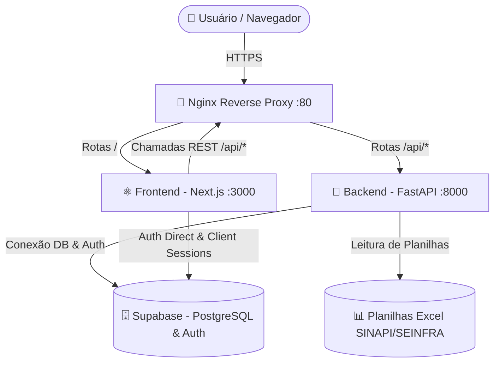

<h1 align="center">🏗️ Projeto Orçamento</h1>

<p align="center">
  Plataforma web completa para <strong>gestão e elaboração de orçamentos de construção civil</strong>, com suporte a composições de custo (SINAPI/SEINFRA), controle de obras, almoxarifado, diário de obras, módulo financeiro, equipes e exportação de relatórios em PDF.
</p>

<p align="center">
  
  
  
  
  
  
  
  
</p>

---

## 📋 Sumário

- [Sobre o Projeto](#-sobre-o-projeto)
- [Funcionalidades](#-funcionalidades)
- [Tecnologias Utilizadas](#-tecnologias-utilizadas)
- [Arquitetura do Sistema](#-arquitetura-do-sistema)
- [Estrutura do Repositório](#-estrutura-do-repositório)
- [Pré-requisitos](#-pré-requisitos)
- [Guia de Instalação](#-guia-de-instalação)
  - [Variáveis de Ambiente](#1-variáveis-de-ambiente)
  - [Executando com Docker (Recomendado)](#2-executando-com-docker-recomendado)
  - [Executando Manualmente](#3-executando-manualmente)
- [Scripts Disponíveis](#-scripts-disponíveis)
- [Deploy em Produção](#-deploy-em-produção)
- [Contribuição](#-contribuição)

---

## 🎯 Sobre o Projeto

O **Projeto Orçamento** é uma plataforma web desenvolvida para gerenciar o ciclo completo de um projeto de construção civil — desde a orçamentação inicial até o acompanhamento detalhado da execução. O objetivo é aumentar a eficiência operacional, reduzir custos e garantir a entrega pontual e dentro do orçamento de cada empreendimento.

A aplicação permite que **gestores de obras**, **escritórios de engenharia** e **construtoras**:

- **Elaborem orçamentos detalhados** com base nas tabelas de referência oficiais (SINAPI e SEINFRA), com cálculo automático de BDI;
- **Gerenciem múltiplas obras** com controle de status, tipo de construção e prazo;
- **Controlem o almoxarifado** com gestão de materiais e estoque por obra;
- **Acompanhem o diário de obra** com registros cronológicos de atividades e ocorrências;
- **Monitorem o aspecto financeiro** com visões de custo orçado vs. executado e fluxo de caixa;
- **Gerenciem equipes** com cadastro e alocação de membros a projetos;
- **Exportem relatórios em PDF** das planilhas orçamentárias diretamente pela interface;
- **Importem e atualizem bases de dados** de referência (SINAPI/SEINFRA) via upload de planilhas Excel.

---

## ✨ Funcionalidades

| Módulo | Descrição |
|---|---|
| 🔑 **Autenticação** | Login e cadastro seguros via Supabase Auth com proteção de rotas por middleware |
| 📊 **Dashboard** | Visão geral do sistema com gráficos e indicadores de performance (Chart.js) |
| 🏢 **Gestão de Obras** | Criação de obras com tipo de construção, BDI personalizado, status e base de referência regional (UF) |
| 📋 **Planilha Orçamentária** | Planilha hierárquica organizada por etapas e subitens, com cálculo automático de custos diretos, indiretos e preço de venda |
| 📐 **Memória de Cálculo & Fórmulas** | Memorial de cálculo estruturado com variáveis dinâmicas (1, 2, 3+ dimensões), linhas de elementos (E1, E2, ...), variáveis globais e campo obrigatório de fórmula matemática de cálculo |
| 🔍 **Composições de Custo** | Busca e adição de insumos/composições das bases SINAPI e SEINFRA por termo, código ou estado (UF) |
| 📤 **Importação de Bases** | Upload de planilhas Excel oficiais (SINAPI/SEINFRA) com processamento em segundo plano e log de resultados |
| 📄 **Exportação PDF** | Geração automatizada de relatórios de orçamento em PDF |
| 📅 **Diário de Obra** | Registro cronológico de atividades, ocorrências, clima e recursos utilizados na obra |
| 💰 **Módulo Financeiro** | Visão financeira consolidada com comparativo orçado vs. executado e fluxo de caixa |
| 👥 **Gestão de Equipes** | Cadastro de equipes e alocação de membros às obras |
| 📦 **Almoxarifado** | Controle de materiais, estoque e movimentações de insumos por obra |
| ⚙️ **Área Admin** | Configurações avançadas e gerenciamento das bases de dados de referência |

---

## 🚀 Tecnologias Utilizadas

### Frontend

| Tecnologia | Versão | Uso |
|---|---|---|
| [Next.js](https://nextjs.org/) | 15 | Framework React com App Router e Turbopack |
| [React](https://react.dev/) | 19 | Biblioteca de UI |
| [TypeScript](https://www.typescriptlang.org/) | 5 | Tipagem estática |
| [Tailwind CSS](https://tailwindcss.com/) | 3 | Estilização utilitária |
| [Radix UI](https://www.radix-ui.com/) | — | Primitivos de UI acessíveis (Shadcn/UI) |
| [Phosphor Icons](https://phosphoricons.com/) | 2 | Biblioteca de ícones |
| [Chart.js](https://chart.js.org/) | 4 | Gráficos e visualizações de dados |
| [Supabase JS](https://supabase.com/docs/reference/javascript) | 2 | Autenticação e acesso ao banco no cliente |

### Backend

| Tecnologia | Versão | Uso |
|---|---|---|
| [FastAPI](https://fastapi.tiangolo.com/) | 0.100+ | Framework da API REST |
| [Python](https://www.python.org/) | 3.10+ | Linguagem principal |
| [Pydantic](https://docs.pydantic.dev/) | 2+ | Validação de schemas e configurações |
| [Supabase Python](https://supabase.com/docs/reference/python) | 2+ | Cliente do banco de dados |
| [Pandas](https://pandas.pydata.org/) | 2+ | Processamento de planilhas Excel |
| [openpyxl](https://openpyxl.readthedocs.io/) | 3.1+ | Leitura de arquivos .xlsx |
| [fpdf2](https://py-pdf.github.io/fpdf2/) | 2.7+ | Geração de PDFs |
| [Uvicorn](https://www.uvicorn.org/) / [Gunicorn](https://gunicorn.org/) | — | Servidor ASGI |

### Infraestrutura

| Tecnologia | Uso |
|---|---|
| [Supabase](https://supabase.com/) | Banco de dados PostgreSQL + Autenticação |
| [Docker & Docker Compose](https://www.docker.com/) | Conteinerização dos serviços |
| [Nginx](https://www.nginx.com/) | Reverse proxy em produção |

### Testes

| Tecnologia | Escopo |
|---|---|
| [Jest](https://jestjs.io/) + [React Testing Library](https://testing-library.com/) | Testes unitários e de componentes (Frontend) |
| [Pytest](https://docs.pytest.org/) | Testes unitários e de integração (Backend) |

---

## 🏛️ Arquitetura do Sistema

O projeto é estruturado como um **monorepo** com separação clara entre frontend, backend e infraestrutura.

### Fluxo de Dados



### Arquitetura Backend — Modular por Domínio

O backend adota uma **arquitetura modular**, onde cada domínio de negócio é encapsulado em seu próprio módulo com responsabilidades bem definidas:

```
backend/app/modules/<módulo>/
├── __init__.py
├── routes.py         # Endpoints HTTP (FastAPI Router)
├── schemas.py        # Schemas Pydantic (request/response)
├── services.py       # Regras de negócio
└── repositories.py   # Acesso ao banco de dados (Supabase)
```

| Módulo | Responsabilidade |
|---|---|
| `almoxarifado` | Controle de materiais e estoque de obra |
| `composicao` | Busca e gestão de composições de custo (SINAPI/SEINFRA) |
| `equipe` | Gestão de equipes e alocação de membros |
| `etapa` | Etapas hierárquicas do orçamento |
| `financeiro` | Controle financeiro, fluxo de caixa e comparativo orçado vs. executado |
| `importacao` | Upload e processamento de planilhas Excel — contém subpasta `services/` com parsers dedicados |
| `obra` | CRUD completo de obras |
| `orcamento` | Planilha orçamentária, itens, cálculo de BDI e exportação PDF |

### Arquitetura Frontend — App Router

O frontend segue a convenção do **App Router** do Next.js 15, priorizando **Server Components** por padrão e usando `'use client'` apenas onde há interatividade. A comunicação com o backend é encapsulada em uma **camada de serviço** (`src/lib/api/`) que utiliza um wrapper `fetchWithAuth` para padronizar headers, tokens JWT e tratamento de erros.

---

## 📁 Estrutura do Repositório

```
Projeto_Orcamento/
│
├── 📁 frontend/                         # Aplicação Web (Next.js 15)
│   └── src/
│       ├── app/                         # Rotas (App Router)
│       │   ├── (dashboard)/             # Área autenticada
│       │   │   ├── admin/               # Área administrativa
│       │   │   ├── bases/               # Pesquisa de bases SINAPI/SEINFRA
│       │   │   ├── diario/              # Diário de obra
│       │   │   ├── equipe/              # Gestão de equipes
│       │   │   ├── financeiro/          # Módulo financeiro
│       │   │   ├── obras/               # Gestão de obras
│       │   │   ├── orcamentos/          # Listagem de orçamentos
│       │   │   └── page.tsx             # Dashboard principal
│       │   ├── api/                     # API Routes (Next.js)
│       │   ├── auth/                    # Callbacks de autenticação
│       │   ├── login/                   # Página de login
│       │   └── signup/                  # Página de cadastro
│       ├── components/                  # Componentes reutilizáveis
│       │   ├── admin/                   # Componentes da área admin
│       │   ├── auth/                    # Formulários de autenticação
│       │   ├── bases/                   # Busca de composições
│       │   ├── common/                  # Componentes compartilhados
│       │   ├── dashboard/               # Componentes do dashboard
│       │   ├── layout/                  # Sidebar, TopHeader
│       │   ├── obras/                   # Componentes de obras
│       │   ├── orcamentos/              # Planilha orçamentária
│       │   └── ui/                      # Primitivos de UI (Shadcn/Radix)
│       ├── contexts/                    # Contextos React (WizardContext)
│       ├── hooks/                       # Custom hooks (use-user-role)
│       ├── lib/
│       │   ├── api/                     # Camada de serviço (fetch wrappers)
│       │   │   ├── client.ts            # fetchWithAuth — wrapper autenticado
│       │   │   ├── almoxarifado.ts       # API de almoxarifado
│       │   │   ├── composicoes.ts        # API de composições
│       │   │   ├── equipes.ts            # API de equipes
│       │   │   ├── financeiro.ts         # API financeiro
│       │   │   ├── importacao.ts         # API de importação
│       │   │   ├── membros_equipe.ts     # API de membros de equipe
│       │   │   ├── obras.ts              # API de obras
│       │   │   └── orcamentos.ts         # API de orçamentos
│       │   ├── api.ts                   # Utilitário base de API
│       │   └── utils.ts                 # Utilitários gerais
│       ├── utils/                       # Helpers genéricos
│       ├── __tests__/                   # Testes automatizados
│       └── middleware.ts                # Proteção de rotas autenticadas
│
├── 📁 backend/                          # API REST (FastAPI + Python)
│   └── app/
│       ├── main.py                      # Ponto de entrada, middlewares, registro de rotas
│       ├── dependencies.py              # Injeção de dependências (Supabase client)
│       └── modules/                     # Módulos de domínio
│           ├── almoxarifado/            # Controle de materiais e estoque
│           ├── composicao/              # Composições de custo SINAPI/SEINFRA
│           ├── equipe/                  # Gestão de equipes
│           ├── etapa/                   # Etapas do orçamento
│           ├── financeiro/              # Controle financeiro
│           ├── importacao/              # Upload e processamento de planilhas
│           │   ├── routes.py
│           │   └── services/            # Parsers dedicados
│           │       ├── base_excel_parser.py
│           │       ├── sinapi_excel_parser.py
│           │       ├── seinfra_excel_parser.py
│           │       ├── parser_factory.py
│           │       ├── import_service.py
│           │       ├── pdf_service.py
│           │       └── sinapi_text_utils.py
│           ├── obra/                    # CRUD de obras
│           └── orcamento/               # Planilha orçamentária e exportação PDF
│               ├── routes.py
│               ├── schemas.py
│               ├── services.py
│               ├── repositories.py
│               └── export.py            # Geração de PDF
│
├── 📁 nginx/                            # Configuração do reverse proxy
│   ├── nginx.conf
│   └── Dockerfile
│
├── 📁 scripts/                          # Scripts de deploy e automação
│   ├── deploy.sh                        # Script de deploy automatizado
│   └── webhook_listener.py              # Listener de webhooks para CI/CD
```
